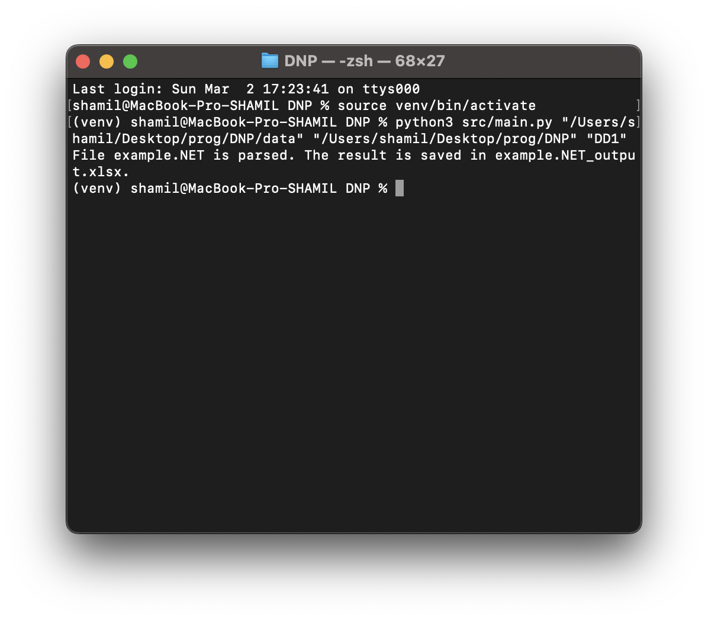
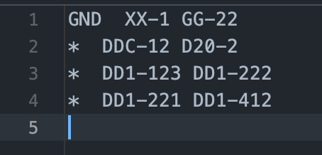
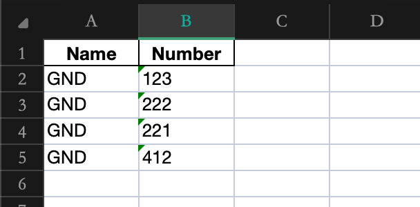

<br>
<br>

<pre style="text-align: center; font-family: monospace;">
<code>
 ____        _   _   _      _   ____                          
|  _ \  ___ | |_| \ | | ___| |_|  _ \ __ _ _ __ ___  ___ _ __ 
| | | |/ _ \| __|  \| |/ _ \ __| |_) / _` | '__/ __|/ _ \ '__|
| |_| | (_) | |_| |\  |  __/ |_|  __/ (_| | |  \__ \  __/ |   
|____/ \___/ \__|_| \_|\___|\__|_|   \__,_|_|  |___/\___|_|   
</code>
</pre>

<h4 style="text-align: center;">DotNetParser - the script that parse net-lists (.NET-files) generated by Altium Designer. It finds a specific keyword (pin name) and pushes it to an Excel document in the next format "(PIN NAME) (PIN NUMBER)".
</h4>


## Installation

1. Clone the repository. <br>
	```git clone https://github.com/TONYFIERRO/dot-net-parser.git``` <br>

2. Install all dependencies that wrote in *Dependencies*. 

3. Open terminal and write ```python src/main.py "path where .NET-files located" "path where result will be saved" "keyword (pin name) to find"```.

## Dependencies

1. Python 3.11.
2. Libraries in *requirements.txt*.

## Screenshots



---
Netlist:



Result:



## Additional
In ```bin/DotNetParser.exe``` was generated executable file for Windows users.

To run it, use: ```./DotNetParser.exe "path where .NET-files located" "path where result will be saved" "keyword (pin name) to find"```

## Licence

The MIT Licence. More detailed in LICENCE file.

## Contacts

Author: Shamil Zaripov <br>
Email: mail@tonyfierro.com <br>
Telegram: @tonyfierro <br>
